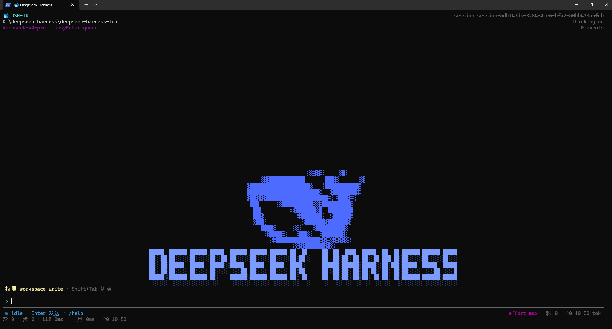
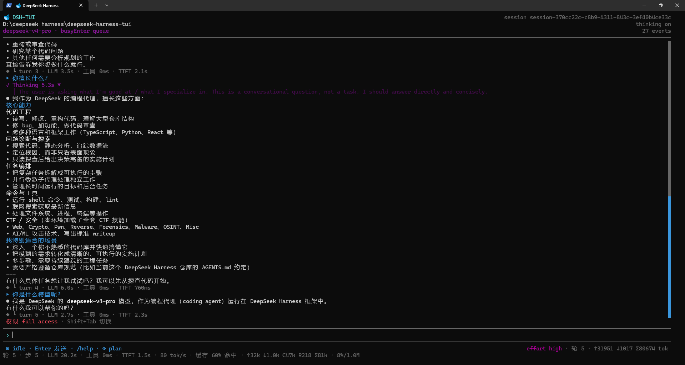

# DeepSeek Harness TUI (`dsh-tui`)

[English](README.md) | 中文

<p align="center">
  <a href="#quick-start"></a>
  <a href="#architecture"></a>
  <a href="#architecture"></a>
  <a href="#architecture"></a>
  <a href="#key-features"></a>
</p>

<p align="center"><strong>English</strong> · <a href="#简体中文">简体中文</a> · Local-first · Session persistence · Tool runtime</p>

> 🚀 **Release Candidate `0.1.0-rc.10`** — clean-room installation verified on
> Windows, macOS, and Linux. Not stable yet. See [Quick Start](#quick-start).

<p align="center">
  
  
</p>

`dsh-tui` is a **local terminal assistant** for the DeepSeek Harness agent
runtime — a Claude Code-style CLI with a React 19 + Ink 7 interface: thinking
shimmer, streaming replies, tool cards, permissions, slash-command palette,
persistent sessions, and settings panels.

## Quick Start

### 1. Install the environment

`dsh-tui` needs **Node.js `^22.19 || >=24`** — npm is bundled with Node, so
installing Node installs npm too.

Check what is already there:

```sh
node --version   # must be ^22.19 || >=24
npm --version
```

If Node is missing or too old, install it one of these ways:

- **Windows** — the official installer from
  [nodejs.org](https://nodejs.org/en/download), or
  `winget install OpenJS.NodeJS.LTS`
- **macOS** — `brew install node`, or the nodejs.org installer
- **Ubuntu / Debian** — use
  [NodeSource](https://github.com/nodesource/distributions) (Node 24 LTS);
  the distro `apt` package is usually too old
- **Any platform** — [nvm](https://github.com/nvm-sh/nvm) (nvm-windows on
  Windows) to switch Node versions freely

Re-run the version checks above, then continue.

### 2. Install dsh-tui

```sh
npm install -g @jame100101/dsh-tui@rc
```

To pin this release candidate exactly:

```sh
npm install -g @jame100101/dsh-tui@0.1.0-rc.10
```

The package ships its runtime inside the tarball — nothing else to install.

### 3. Verify

```sh
dsh-tui --version
# 0.1.0-rc.10
```

### 4. Start in your project

```sh
cd your-project
dsh-tui
```

The current working directory is the default workspace for the agent.

### 5. Configure the DeepSeek API key

The easiest way is inside the TUI itself:

1. Type `/settings`, then `Tab` to the **Models** page.
2. Under **API credentials**, select the DeepSeek credential and press
   **Enter**.
3. Type your key (the input is **masked, never echoed**) and confirm with
   **Enter**.

Credentials are stored locally in `$DSH_HOME/.credentials.yaml`
(`~/.dsh/.credentials.yaml` by default), are never displayed, and take effect
for the next request — no restart needed. (A credential shadowed by an
environment variable is shown as read-only in this page.)

**Alternative — environment variable:**

```sh
# Windows PowerShell
$env:DEEPSEEK_API_KEY="your-api-key"
# Windows, persist for the current user (new terminals only):
setx DEEPSEEK_API_KEY "your-api-key"
# macOS / Linux
export DEEPSEEK_API_KEY="your-api-key"
```

### 6. Start coding

Type a task in the composer and press **Enter**. Type `/help` for the full
slash-command catalog.

## Common Commands

| Command | What it does |
| --- | --- |
| `dsh-tui` | interactive TUI, new session in the current directory |
| `dsh-tui "<task>"` | open the TUI and submit the task immediately |
| `dsh-tui -c` / `--continue` | resume the newest session created in this directory |
| `dsh-tui -r` | open the interactive session picker |
| `dsh-tui -r <session-id>` | resume a session by id, id prefix, or title |
| `dsh-tui -c --fork-session` | fork the resumed session at its last completed turn |
| `dsh-tui -p "<task>"` | one-shot: print the assistant result to stdout, no TUI |
| `dsh-tui -c -p "<task>"` | resume, then run one task non-interactively |
| `dsh-tui --help` | show the help |

Exit codes: `0` success · `1` runtime failure · `2` usage error · `130` SIGINT.
`--print` writes only the assistant result to stdout; diagnostics go to stderr.

## Key Features

- **React + Ink terminal UI** with streaming replies, Markdown rendering, and
  a thinking shimmer you can expand or collapse.
- **Current-directory workspace** — sessions remember the directory they were
  created in; `-c` resumes only sessions from the current directory.
- **Persistent sessions** — full history replay on resume, live session
  picker, renaming, and `/fork` (the original session is never overwritten).
- **Print mode** — `-p` is clean, scriptable, CI-friendly output.
- **Settings** — five pages: General, Models (catalog + **API credentials**),
  Plugins, Inventory, and agent Presets.
- **Tools & permissions** — bash/pwsh/file/web tools behind a sandbox-mode
  bar (`Shift+Tab` rotates read-only → workspace-write → danger-full-access),
  with approval and ask-user takeovers.
- **Slash-command palette** — `/` opens the alphabetical command palette;
  `Tab` completes, `Esc` dismisses.
- **Mouse & keyboard navigation** — wheel/pgup/pgdn scrolling, a right-edge
  scrollbar with a back-to-bottom button, transcript selection mode, and
  per-message 👍/👎 feedback.
- **npm distribution** — a single self-contained global install.

## Maintenance

```sh
npm install -g @jame100101/dsh-tui@rc   # upgrade to the newest RC
npm uninstall -g @jame100101/dsh-tui    # uninstall
```

## Development

Normal users do not need this section.

```sh
pnpm install
pnpm dsh --profile tui        # run from source (tsx)
pnpm run build                # build once, after install or source changes
pnpm exec dsh --profile tui   # run the built fast path
```

This repository is a separate full copy of the `deepseek-harness` workspace
plus the TUI plugin (`packages/tui/tui`, the in-process plugin
`@deepseek-ai/dsh-tui`) and the launcher entry (`apps/tui-cli`). The original
repository is never modified.

## Architecture

```text
dsh-tui (CLI wrapper, apps/tui-cli)
  → dsh launcher (bundled runtime)
  → Cordis plugin composition (profile: tui)
  → React + Ink TUI plugin (@deepseek-ai/dsh-tui)
  → event-sourced session log → live transcript rows
```

The wrapper only translates launch flags and spawns the bundled runtime. The
TUI plugin folds the append-only session log into transcript rows (user,
assistant, thinking, tool cards, retries, status) and drives either the Ink
full-screen renderer (TTY) or a line-driven fallback (pipes/CI).

For a feature-by-feature comparison with the Web frontend, see
**[TUI-WEB-COMPARISON.md](TUI-WEB-COMPARISON.md)**.

## 简体中文

### 项目状态

已作为 **Release Candidate** 发布：`@jame100101/dsh-tui@0.1.0-rc.10`
（dist-tag：`rc`）。Windows / macOS / Linux 干净环境安装已验证，尚未 stable。

### 快速开始

**环境准备**：需要 Node.js `^22.19 || >=24`（npm 随 Node 自带）。先执行
`node --version` 和 `npm --version` 检查；没有或版本太旧时：Windows 用
[nodejs.org](https://nodejs.org/en/download) 安装包或
`winget install OpenJS.NodeJS.LTS`，macOS 用 `brew install node`，
Ubuntu/Debian 用 NodeSource（系统 apt 的 nodejs 通常太旧），任意平台可用
nvm。

```sh
npm install -g @jame100101/dsh-tui@rc      # 安装（固定版本：@0.1.0-rc.10）
dsh-tui --version                          # 验证，输出 0.1.0-rc.10
cd 你的项目
dsh-tui                                    # 启动；当前目录即默认 workspace
```

**配置 API Key（推荐在 TUI 内完成）**：输入 `/settings`，`Tab` 切到
**Models** 页，在 **API credentials** 中选中 DeepSeek 凭据按 **Enter**，
输入 Key（输入**不回显**）再按 **Enter** 确认。凭据保存在
`$DSH_HOME/.credentials.yaml`（默认 `~/.dsh/.credentials.yaml`），
永不显示，下次请求即生效，无需重启。环境变量方式（可选）：
`$env:DEEPSEEK_API_KEY="你的-key"`（Windows PowerShell）或
`export DEEPSEEK_API_KEY="你的-key"`（macOS / Linux）。

**常用命令**

| 命令 | 作用 |
| --- | --- |
| `dsh-tui "<任务>"` | 启动后立即提交任务 |
| `dsh-tui -c` | 恢复当前目录最近的会话 |
| `dsh-tui -r` / `-r <id>` | 会话选择面板 / 直接恢复指定会话 |
| `dsh-tui -c --fork-session` | 从已有会话分叉（不覆盖原会话） |
| `dsh-tui -p "<任务>"` | 非交互：stdout 输出结果，适合脚本/CI |
| `dsh-tui --help` | 帮助 |

### 源码开发

```sh
pnpm install
pnpm dsh --profile tui        # 源码启动（tsx）
pnpm run build
pnpm exec dsh --profile tui   # 构建产物启动
```
